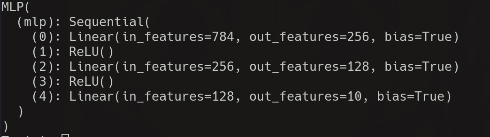
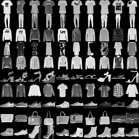
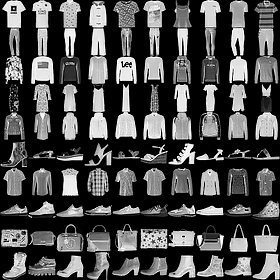
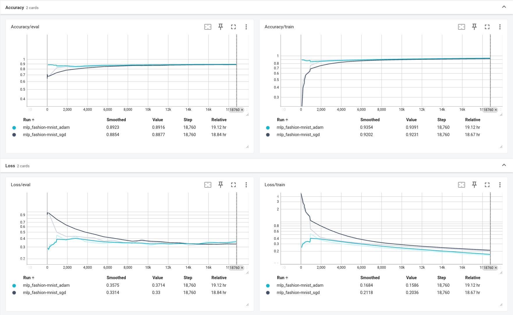

# HW1 Report

Implemented a 2-layer MLP, trained with Fashion-MNIST, and got 93% accuracy on training and 88% on evaluation

- [PyTorch](https://pytorch.org/) framework to implement `MNIST` (dataloader for both MNIST and Fashion-MNIST), `MLP`, `train` and `evaluate`
    
    - `torch.nn.Module` to create models, and to do forward/backward pass

    - `torch.optim` to create optimizers, and to do gradient descent

    - `torch.nn.functional` to call cross entropy loss function

    - `torch.utils.data` to create `Dataset` and do batch loading / data shuffling with `DataLoader`

    - `torch.utils.tensorboard.writer` to create `SummaryWriter` which outputs loss/accuracy to `TensorBoard`

- some core modules from previous projects to load configurations, track training states, record training/eval loss/accuracy, and output results to `TensorBoard` to provide visualization

- save sample plots using `pillow`

## Data Processing
- Execute a bash script to download 4 files from [repo](https://github.com/zalandoresearch/fashion-mnist?tab=readme-ov-file#get-the-data)

- Convert bytes to images/labels when initializing dataset
```python
images = []
with open(file, "rb") as f:
    f.read(4)  # skip magic number
    n_image = int.from_bytes(f.read(4))
    height = int.from_bytes(f.read(4))
    width = int.from_bytes(f.read(4))

    print(f"#Images: {n_image} | Rows: {height} | Width: {width}")

    chunk_size = height * width
    while chunk := f.read(chunk_size):
        image_raw = np.array(list(chunk)).reshape(height, width)
        images.append(image_raw)

# NOTE: list of numpy 1d -> use stack because we need a new dim
images = np.stack(images, axis=0).astype(np.uint8)
```

- Normalize images to the range of 0,1 in `Dataset.__getitem__(self, index)`

<div style="page-break-after: always;"></div>

## Settings
MLP


Optimizers
- SGD: `lr = 1e-1`

- Adam: `lr = 1e-3, beta1 = 0.9, beta2 = 0.999` (default setting)

Create optimizer based on the name of optimizer
```python
match self.name:
    case "sgd":
        return optim.SGD(params, lr=self.lr)  # type: ignore
    case "adam":
        return optim.Adam(params, lr=self.lr, betas=(self.beta1, self.beta2))  # type: ignore
    case "adamw":
        return optim.AdamW(params, lr=self.lr, betas=(self.beta1, self.beta2))  # type: ignore
    case _:
        raise OptimizerNotDefined(f"{self.name} not defined")

```

Full settings are described in the [final part](#extra-configurations)

<div style="page-break-after: always;"></div>

## Implementation Details
- Images should be normalized before they get fed into MLP
```python
image_raw = torch.tensor(self.images[index]) / 255
```

- Convert list of numpy array to numpy array
    - when inputs are batches, use `np.concat`
    ```python
    # NOTE: list of batches -> concatenate because it already has 3 dims
    all_images = np.concatenate(all_images, axis=0).astype(np.uint8)
    all_preds = np.concatenate(all_preds, axis=0).flatten()
    ```
    - when inputs are rows, use `np.stack`
    ```python
    # NOTE: list of numpy 1d -> use stack because we need a new dim
    images = np.stack(images, axis=0).astype(np.uint8)
    ```

- Training step
```python
# Transfer to specified device
images = images.to(device)
labels = labels.to(device)

# Forward propagation
logits = model(images)

# Cross entropy loss
loss = F.cross_entropy(logits, labels)

...

# Backward propagation
optimizer.zero_grad()
loss.backward()
optimizer.step()
```

- Eval & Prediction: don't forget to set `model.eval()` and add `torch.no_grad` decorator/context manager

    - `model.eval()` ensures dropout, batch norm behave different in evaluation 

    - `torch.no_grad` saves memory and ensures all new tensors doesn't store intermediate tensors needed to calculate gradients

- In order to show images with `pillow`, images should be denormalized (and should be uint8)
```python
# NOTE: denormalize
all_images.append(255 * images.cpu().numpy())
```

<div style="page-break-after: always;"></div>

## Result
Randomly chose 10 samples for each class

### SGD


### Adam


### Loss/Acc Plot


- Adam optimizer uses a smaller learning rate (1e-3) compared with SGD (1e-1)

- Adam optimizer has a good initial loss, while SGD doesn't (maybe because of bad weight/bias initialization)

- Adam converges faster than SGD


<div style="page-break-after: always;"></div>

## Extra: configurations
SGD
```toml
n_epoch = 20
seed = 42
batch_size = 64

[data]
root = "data/fashion-mnist"
# root = "data/mnist"
train_images = "train-images-idx3-ubyte"
train_labels = "train-labels-idx1-ubyte"
test_images = "t10k-images-idx3-ubyte"
test_labels = "t10k-labels-idx1-ubyte"

[optim]
name = "sgd"
lr = 1e-1
beta1 = 0.9
beta2 = 0.999

[model]
name = "mlp"
hidden1 = 256
hidden2 = 128

```

Adam
```toml
n_epoch = 20
seed = 42
batch_size = 64

[data]
root = "data/fashion-mnist"
# root = "data/mnist"
train_images = "train-images-idx3-ubyte"
train_labels = "train-labels-idx1-ubyte"
test_images = "t10k-images-idx3-ubyte"
test_labels = "t10k-labels-idx1-ubyte"

[optim]
name = "adam"
lr = 1e-3
beta1 = 0.9
beta2 = 0.999

[model]
name = "mlp"
hidden1 = 256
hidden2 = 128

```
