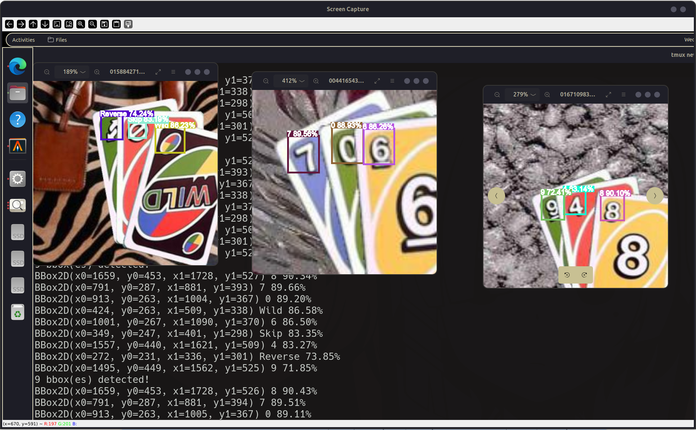
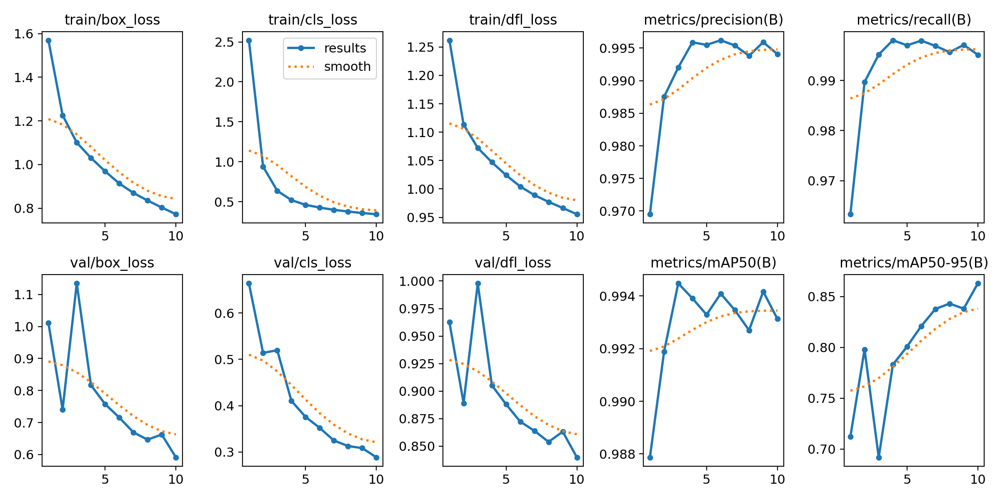

# HW2 Report

I trained a YOLOv11 model to detect UNO cards (99% acc on dataset) and provides a demo that detects
UNO cards from the captured screen in real-time.




- Thanks to [ultralytics YOLO](https://docs.ultralytics.com), I can train a YOLO model 
and detect bounding boxes with just a few lines of code

- The implementation of demo is based on `pillow` and `cv2`. Specifically,
    - `PIL.ImageDraw`: drawing the bounding boxes with text on top of it
    - `PIL.ImageGrab`: capturing screen(s) and storing the image in `PIL.Image.Image` format
    - `cv2.imshow` and `cv2.waitKey(1)`: output the processed image to a window

## Dataset
An annotated dataset [uno-cards (v3, aug416)](https://universe.roboflow.com/joseph-nelson/uno-cards)
that provides bounding box annotations of UNO cards, data augmentations, and preprocessed popular data formats.

- Train set: 31475 images with bounding boxes and labels
- Valid set: 1798 images with bounding boxes and labels
- Test set: 899 images with bounding boxes and labels

Detailed augmentations are described below:

```
Augmentations
Outputs per training example: 5
Crop: 0% Minimum Zoom, 25% Maximum Zoom
Rotation: Between -10° and +10°
Shear: ±10° Horizontal, ±10° Vertical
Grayscale: Apply to 5% of images
Hue: Between -5° and +5°
Saturation: Between -10% and +10%
Brightness: Between -15% and +15%
Exposure: Between -15% and +15%
Blur: Up to 1.5px
```

## Regularization
`ultralytics` already sets some regularization techniques as default. 
- Early stop (Patience)
- Dropout

You can pass in your setting in `model.train` to override them:
```python
model.train(
    ...
    dropout=config.hparams.dropout,
    patience=config.hparams.patience,
)
```

This is a part of the `args.yaml` auto generated during the run
```yaml
task: detect
mode: train
model: yolo11n.pt
data: data/uno-cards/data.yaml
epochs: 10

...

patience: 5
batch: 64

...

dropout: 0.2
```


## Implementation Details

### `dataset.yaml` in `ultralytics`

`ultralytics` supports loading dataset based on a yaml config. 
The recommended format in official documentation is as follows:

```yaml
# Train/val/test sets as 1) dir: path/to/imgs, 2) file: path/to/imgs.txt, or 3) list: [path/to/imgs1, path/to/imgs2, ..]
path: ../datasets/coco8 # dataset root dir
train: images/train # train images (relative to 'path') 4 images
val: images/val # val images (relative to 'path') 4 images
test: # test images (optional)

# Classes (80 COCO classes)
names:
    0: person
    1: bicycle
    2: car
    # ...
    77: teddy bear
    78: hair drier
    79: toothbrush
```

However, [roboflow](https://roboflow.com/formats/yolov11-pytorch-txt) stores `names` as `list` 
instead of `dict`:

```yaml
names: ['0', '1', '10', '11', '12', '13', '14', '2', '3', '4', '5', '6', '7', '8', '9']
```

After some trail-and-errors (which actually takes a long time), I found the conversion from list to dict is `dict(enumerate(names))`.

Adding the exact labels from [unorules](https://www.unorules.com/), I'm able to list the mapping of labels:

```yaml
# Modified name mapping referenced from https://www.unorules.com/
names:
  0: "0"
  1: "1"
  2: "Wild Draw 4"
  3: "Draw Two"
  4: "Reverse"
  5: "Skip"
  6: "Wild"
  7: "2"
  8: "3"
  9: "4"
  10: "5"
  11: "6"
  12: "7"
  13: "8"
  14: "9"
```

### Demo

- The color of bounding boxes is depended on the predicted class. Randomly generate `k` colors 
at the start and index them by `label_id` later

```python
def set_colors(self, k: int) -> None:
    self.colors = [f"#{color_hex:x}" for color_hex in random.sample(range(0xFFFFFF), k=k)]
    print(self.colors)
```

- In order to render text above the detected bounding boxes, there're two steps

    - compute the `text_anchor`: `text_anchor` is the top left corner of the displayed text,
    and can be computed from the bounding box of the detected object
    ```python
    def get_textbox_anchor(bbox: BBox2D, text_y_offset: int) -> tuple[int, int]:
        x0, y0 = bbox.top_left
        return x0, y0 - text_y_offset
    ```

    - render text including a bounding box with background color
    ```python
    text_anchor = get_textbox_anchor(bbox, config.draw.text_y_offset)
    # Get the coordinates of text box
    textbbox = image_draw.textbbox(
        text_anchor,
        text=display_text,
        font=config.draw.image_font,
        stroke_width=config.draw.text_width,
    )
    # Render the text box
    image_draw.rectangle(
        textbbox,
        fill=color,
        width=config.draw.bbox_width,
    )
    # Render the text
    image_draw.text(
        text_anchor,
        display_text,
        font=config.draw.image_font,
        stroke_width=config.draw.text_width,
    )
    ```
