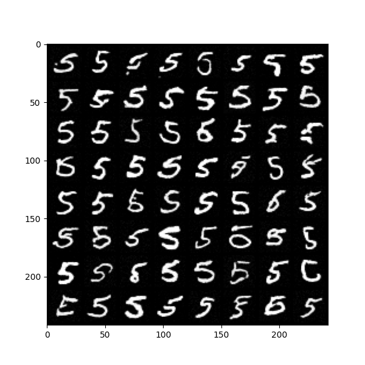

# HW3 Report

I reimplemented a [Diffusion Model](https://lilianweng.github.io/posts/2021-07-11-diffusion-models/), 
a simplified version of [Stable Diffusion](https://ommer-lab.com/research/latent-diffusion-models/), 
and trained it on MNIST. 


## What is Diffusion Model

Diffusion Model is a generative model that combines 
**Reverse Diffusion**, 
**Spatial Transformer**
and **U-Net**.


### 1. Diffusion (Core)
The key idea of Diffusion Model is:
 - Add noises gradually in the forward pass (forward diffusion)
 - Find a way to remove noises in the backward pass (reverse diffusion). 

During the reverse diffusion, the update rule is related to **score function**:

$$
    \frac{d}{dx} \log p(x, T - t)
$$

where $x$ is the input of current step, $t$ is the current time step, and $T$ is the total steps we need to take. 

Unfortunately, we don't know how to compute the score function and have to learn it. One way to learn the score function is **training a U-Net, a CNN-based downsampling+upsampling model**, which will be discussed later.

### 2. Spatial Transformer (Text Encoding)

Spatial Transformer is one type of Transformers. Different from the classic one, Spatial Transformer takes in **feature map** as input, adds **conditional constraints** (i.e. numbers in MNIST) onto the existing features, making image generation more controllable. 

**Attention Block** is the core of Spatial Transformer. The basic workflow is as follows: 

- Compute the **attention score matrix** from **query** and **key**. 

- Get normalized using softmax and a scale factor. 

- Combine the attention score matrix with **value** and gets a semantic features on query. 

Depending on the source of inputs, attention is split into two categories:

- Self Attention: query, key and value comes from the same embedding.

- Cross Attention: query comes from `token` embedding, while key and value comes from `context` embedding.

Additionally, to speed up the computation on attention, **Multi-head Attention** is introduced. The basic idea is to 
split the hidden dimension into `num_heads` chunks, and then perform a parallel scaled dot product 
attention.

NOTE: In Stable Diffusion, they actually used [CLIP](https://github.com/openai/CLIP), a pretrained multimodal model as a start.


### 3. U-Net (Backbone)


In general, U-Net receives images as input, then outputs a score that will be used in the reverse diffusion. 
However, the score has to be related to the time step $t$, so we also need to add a `time_embedding`
inside our neural network.

The structure can be split into two parts:

- Encoder: Downsampling images while increasing the number of channels. Moreover,

    - Time embedding is added in each encoder block, letting the model know the information of the time step

    - If Spatial Transformer is added on certain levels with text constraints, U-Net could **learn the relation between text and feature maps, therefore controlling the image generation.**

- Decoder: Upsampling features while decreasing the number of channels. Based on current image and timestep, the decoder will output a score that can be used in the reverse diffusion. 


## Implementation Details

I chose MNIST as the dataset with 28x28 images. In order to fit the dataset, I changed the structure of U-Net by a bit:

- Add padding to convolutional layers of `ResBlock` so that is doesn't reduce the width of feature maps.

- Change the level of both the encoder and decoder from 4 to 2.

Here's the full model config:

```toml
[model]
corpus_length = 10  # MNIST

in_channels = 1
out_channels = 1
num_res_blocks = 2

model_channels = 32
channel_multipliers = [1, 2]  # multipliers on `model_channels` on each level
attention_levels = [2]  # where the attention block should be added

[model.transformer]
context_dim = 256
num_heads = 8
num_layers = 1

```

### U-Net Model

- Copy&Crop: In U-Net, the upsampled feature map `up_x` has to be concatenated with the hidden output `enc_h` of encoder block from the same level. Unfortunately, the width of two feature maps `up_x`, `enc_h` are not equal, and the latter needs to be center-cropped.


The center-cropping code is implemented as follows:

```python
def _center_crop(self, src: torch.Tensor, tar: torch.Tensor) -> torch.Tensor:
    """
    Center-crop the feature map `src` to be the same size as `tar`
    """
    src_w = src.shape[-1]
    tar_w = tar.shape[-1]

    if src_w == tar_w:
        warnings.warn(
            f"Performing ceter cropping, but src_w and tar_w are the same ({tar_w}), skipped"
        )
        return src

    if src_w < tar_w:
        raise CenterCropError(
            f"Performing ceter cropping, but src_w ({src_w}) < tar_w ({tar_w})"
        )

    start = (src_w - tar_w) // 2

    return src[:, :, start:-start, start:-start]
```

NOTE: Due to the low resolution of MNIST, I add paddings for `nn.Conv2D` so that **cropping is not needed.**
But I still keep this method for completeness.

### einops
`einops.rearrange` makes rearranging axes of tensors much easier. 

For instance, if you want to split one axis into chunks, stack them to a new axis, 
then switch multiple axes:

```python
x                                    # (b, t, d)
chunks = x.chunk(num_heads, dim=-1)  # num_heads: n_h, (b, t, d_h) x n_h
x = torch.stack(chunks, dim=-1)      # (b, t, d_h, n_h)
x = x.permute(0, 3, 1, 2)            # (b, n_h, t, d_h)
```

This requires a deep understanding on tensor operations, while `einops.rearrange`
helps you skip them if you can come up with the matrix shape `pattern`

```python
hidden_dim = 768
num_heads = 8
head_dim = hidden_dim / num_heads
rearrange(x, pattern="b t d -> b n_h t d_h", n_h=num_heads, d_h=head_dim)
```


## Result




The model can be further improved by including a **VAE** (variational autoencoder) to **compress images into the low-dimensional latent space**. Due to the time constraints, I didn't implement this part, but I might add one in the future to see the improvement on training :)

---

References:

> Weng, Lilian. (Jul 2021). What are diffusion models? Lil’Log. https://lilianweng.github.io/posts/2021-07-11-diffusion-models/.

> Diffusion Model with Cross Attention. https://colab.research.google.com/drive/1Y5wr91g5jmpCDiX-RLfWL1eSBWoSuLqO?usp=sharing#scrollTo=PUdcXlsLN5J4

Model Structure:

```bash
UNet(
  (context_embed): Embedding(10, 256)
  (time_embed): TimeEmbedding(
    (proj): Linear(in_features=32, out_features=32, bias=True)
  )
  (encoder): ModuleList(
    (0): EncoderBlock(
      (res_blocks): ModuleList(
        (0): ResidualBlock(
          (conv): Conv2d(1, 32, kernel_size=(3, 3), stride=(1, 1), padding=(1, 1))
          (time_lin): Linear(in_features=32, out_features=32, bias=True)
          (gnorm): GroupNorm(32, 32, eps=1e-05, affine=True)
          (silu): SiLU()
        )
        (1): ResidualBlock(
          (conv): Conv2d(32, 32, kernel_size=(3, 3), stride=(1, 1), padding=(1, 1))
          (time_lin): Linear(in_features=32, out_features=32, bias=True)
          (gnorm): GroupNorm(32, 32, eps=1e-05, affine=True)
          (silu): SiLU()
        )
      )
      (downsampling): Conv2d(32, 32, kernel_size=(3, 3), stride=(2, 2), padding=(1, 1), bias=False)
    )
    (1): EncoderBlock(
      (res_blocks): ModuleList(
        (0): ResidualBlock(
          (conv): Conv2d(32, 64, kernel_size=(3, 3), stride=(1, 1), padding=(1, 1))
          (time_lin): Linear(in_features=32, out_features=64, bias=True)
          (gnorm): GroupNorm(32, 64, eps=1e-05, affine=True)
          (silu): SiLU()
        )
        (1): ResidualBlock(
          (conv): Conv2d(64, 64, kernel_size=(3, 3), stride=(1, 1), padding=(1, 1))
          (time_lin): Linear(in_features=32, out_features=64, bias=True)
          (gnorm): GroupNorm(32, 64, eps=1e-05, affine=True)
          (silu): SiLU()
        )
      )
      (downsampling): Conv2d(64, 64, kernel_size=(3, 3), stride=(2, 2), padding=(1, 1), bias=False)
    )
  )
  (mid_block): MidBlock(
    (res1): ResidualBlock(
      (conv): Conv2d(64, 128, kernel_size=(3, 3), stride=(1, 1), padding=(1, 1))
      (time_lin): Linear(in_features=32, out_features=128, bias=True)
      (gnorm): GroupNorm(32, 128, eps=1e-05, affine=True)
      (silu): SiLU()
    )
    (res2): ResidualBlock(
      (conv): Conv2d(128, 128, kernel_size=(3, 3), stride=(1, 1), padding=(1, 1))
      (time_lin): Linear(in_features=32, out_features=128, bias=True)
      (gnorm): GroupNorm(32, 128, eps=1e-05, affine=True)
      (silu): SiLU()
    )
    (st): SpatialTransformer(
      (blocks): ModuleList(
        (0): AttentionBlock(
          (self_attn): MultiHeadAttention(
            (q_proj): Linear(in_features=128, out_features=128, bias=False)
            (k_proj): Linear(in_features=128, out_features=128, bias=False)
            (v_proj): Linear(in_features=128, out_features=128, bias=False)
          )
          (self_attn_norm): LayerNorm((128,), eps=1e-05, elementwise_affine=True)
          (cross_attn): MultiHeadAttention(
            (q_proj): Linear(in_features=128, out_features=128, bias=False)
            (k_proj): Linear(in_features=256, out_features=128, bias=False)
            (v_proj): Linear(in_features=256, out_features=128, bias=False)
          )
          (cross_attn_norm): LayerNorm((128,), eps=1e-05, elementwise_affine=True)
          (mlp): MLP(
            (net): Sequential(
              (0): Linear(in_features=128, out_features=128, bias=True)
              (1): ReLU()
              (2): Linear(in_features=128, out_features=128, bias=True)
            )
          )
          (mlp_norm): LayerNorm((128,), eps=1e-05, elementwise_affine=True)
        )
      )
      (proj_out): Conv2d(128, 128, kernel_size=(1, 1), stride=(1, 1))
    )
  )
  (decoder): ModuleList(
    (0): DecoderBlock(
      (upsampling): ConvTranspose2d(128, 64, kernel_size=(3, 3), stride=(2, 2), padding=(1, 1), output_padding=(1, 1), bias=False)
      (res_blocks): ModuleList(
        (0): ResidualBlock(
          (conv): Conv2d(128, 64, kernel_size=(3, 3), stride=(1, 1), padding=(1, 1))
          (time_lin): Linear(in_features=32, out_features=64, bias=True)
          (gnorm): GroupNorm(32, 64, eps=1e-05, affine=True)
          (silu): SiLU()
        )
        (1): ResidualBlock(
          (conv): Conv2d(64, 64, kernel_size=(3, 3), stride=(1, 1), padding=(1, 1))
          (time_lin): Linear(in_features=32, out_features=64, bias=True)
          (gnorm): GroupNorm(32, 64, eps=1e-05, affine=True)
          (silu): SiLU()
        )
      )
    )
    (1): DecoderBlock(
      (upsampling): ConvTranspose2d(64, 32, kernel_size=(3, 3), stride=(2, 2), padding=(1, 1), output_padding=(1, 1), bias=False)
      (res_blocks): ModuleList(
        (0): ResidualBlock(
          (conv): Conv2d(64, 32, kernel_size=(3, 3), stride=(1, 1), padding=(1, 1))
          (time_lin): Linear(in_features=32, out_features=32, bias=True)
          (gnorm): GroupNorm(32, 32, eps=1e-05, affine=True)
          (silu): SiLU()
        )
        (1): ResidualBlock(
          (conv): Conv2d(32, 32, kernel_size=(3, 3), stride=(1, 1), padding=(1, 1))
          (time_lin): Linear(in_features=32, out_features=32, bias=True)
          (gnorm): GroupNorm(32, 32, eps=1e-05, affine=True)
          (silu): SiLU()
        )
      )
    )
  )
  (proj): Sequential(
    (0): GroupNorm(32, 32, eps=1e-05, affine=True)
    (1): SiLU()
    (2): Conv2d(32, 1, kernel_size=(3, 3), stride=(1, 1), padding=(1, 1))
  )
)

```
